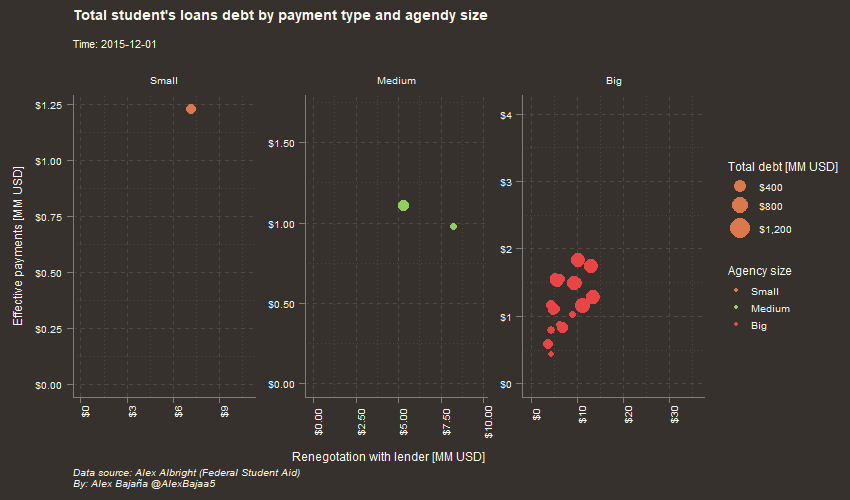

# #tidytuesday Week 48: Student Loan Payments

Student loan debts are a serious fact that many of my fellows are facing, may this attempt contribute to understand this problematic and help to reach out a solutions.

## First concepts:

- Consolidation means assum a new debt in order to pay the student loan
- Rehabilitation means that after an strinct payment plan, the defaults of the borrowers will be erased
- Wage garnishment meant that when the borrower begin to work, a portion of his wage will be retained to pay directly to the lender

## Actions done:

### First steps:

 1. Change the value of the variable quarter for it's equivalent in months
 2. Create a date variable with format %y%m%d

### Clasification of agencies by size:

 1. I replace all NA values with 0
 2. Then, replace symbols and sufixes in order to group all values by agency
 3. After aggragete the total debt acquired, the mean of this vaiable during 
    the study period will give us an idea of agency size
 4. Using the 33, 66, quantiles I create a factor with cut function
 5. I relabel my factor in order to get agency size
 
### Final transformations:

 1. The types of payments are created following the idea that consolidation and loan rehabilitations are forms of renegotation of the original debt, so voluntary payments and wage garnishments are effective payments
 2. Total debt is defined by the starting value at each qaurter plus the added values
 3. Using the element a_size which is a list that contains the agencies in each agency size I clasificate the agencies in the complete table
 4. Reorder the factor using the total_debt value
 5. Scaling tha numeric values divinding them by one millon
 
 ### Plotting:
 
 I used the `ggplot`, `gganimate` and `ggthemr` packages.

  
