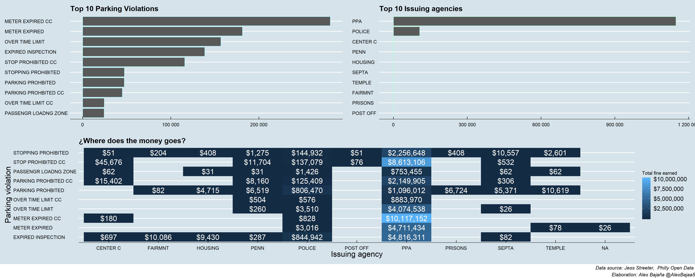

# #tidytuesday Week 49: Parking Violations in Philadelphia

Money earned by fines are distributed among government agencies in order to improve it's resorces and services. Knowing which violations generates the most revenues in each agencie could lead people to ask for accountability of that money.

## Actions done:

### Summary:

 1. The NA values in `issuing_agency` and `violation_desc` where drop 
 2. The numeric value is the number of fines done by each agency by each violation

### Plotting

 1. Using the `pmap` function the two bar plots were generated.
 2. A tile plot is generated using both variables (`issuing_agency` and `violation_desc`)
 3. Using the `ggpubr` and `ggthemes` packages.

  
